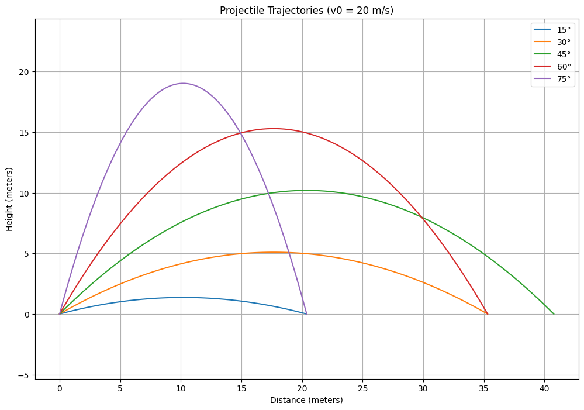
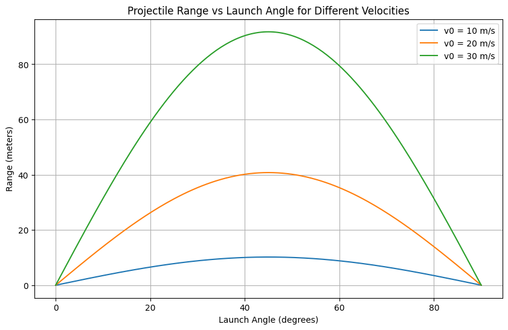

# Problem 1
# **Projectile Motion: Theoretical Foundation**

## **1. Governing Equations of Motion**

Projectile motion follows Newton's laws of motion and assumes motion under uniform gravitational acceleration with no air resistance. The fundamental equations arise from Newton’s Second Law:

$$\mathbf{F}=m\mathbf{a}$$

Since the only force acting on the projectile (neglecting air resistance) is gravity, we have:

$$F_y=-mg,\quad F_x=0$$

Thus, the equations of motion can be written as:

$$m a_x=0 \quad \Rightarrow \quad a_x=0\quad
m a_y=-mg \quad \Rightarrow \quad a_y=-g$$ 

Since acceleration is the second derivative of position, we get:

$$\frac{d^2x}{dt^2}=0,\quad \frac{d^2y}{dt^2}=-g$$

## **2. Solving the Differential Equations**

### **Horizontal Motion**

Integrating the horizontal acceleration equation:

$$\frac{dv_x}{dt}=0$$

$$v_x=v_0\cos\theta$$

Since velocity is the derivative of position:

$$\frac{dx}{dt}=v_0\cos\theta$$

Integrating again:

$$x(t)=v_0\cos\theta\cdot t$$

### **Vertical Motion**

Integrating the vertical acceleration equation:

$$\frac{dv_y}{dt}=-g$$

$$v_y=v_0\sin\theta-gt$$

Since velocity is the derivative of position:

$$\frac{dy}{dt}=v_0\sin\theta-gt$$

Integrating again:

$$y(t)=v_0\sin\theta\cdot t-\frac{1}{2} g t^2$$

## **3. Range of the Projectile**

The range $R$ is the horizontal distance the projectile travels before hitting the ground (i.e., when $y=0$).

Setting $y(t)=0$:

$$0=v_0\sin\theta\cdot t-\frac{1}{2} g t^2$$

Solving for $t$, we get:

$$t=\frac{2 v_0\sin\theta}{g}$$

Substituting into the equation for $x(t)$:

$$R=v_0\cos\theta\cdot\frac{2 v_0\sin\theta}{g}$$

Using the identity $2\sin\theta\cos\theta=\sin 2\theta$, we obtain the range formula:

$$R=\frac{v_0^2\sin 2\theta}{g}$$

## **4. Family of Solutions and Dependence on Initial Conditions**

- The range depends on both the initial velocity $v_0$ and the launch angle $\theta$.
- The **maximum range** occurs at $\theta=45^\circ$, since $\sin 2\theta$ is maximized at $90^\circ$.
- The **same range** can be achieved with complementary angles $\theta_1$ and $\theta_2=90^\circ-\theta_1$, as $\sin 2\theta$ is the same for both.

### **Effect of Gravity**

- Increasing gravity $g$ decreases the range since $R\propto 1/g$.
- Lower gravity environments (e.g., Moon or Mars) allow longer ranges for the same launch velocity.

### **Effect of Initial Velocity**

- The range is **quadratic** in $v_0$, meaning a slight increase in velocity results in a significantly larger range.

## **Conclusion**

The projectile motion equations provide deep insight into real-world applications, from sports physics to space exploration. The range formula highlights the key dependencies on angle, velocity, and gravity, illustrating the elegance of motion under constant acceleration.
# **Projectile Motion: Theoretical Analysis of Range**

## **1. Relationship Between Horizontal Range and Angle of Projection**

The horizontal range $R$ of a projectile is defined as the horizontal distance it travels before returning to its initial height. The standard equation for range, derived from kinematic equations, is:

$$R=\frac{v_0^2\sin 2\theta}{g}$$

where:
- $v_0$ is the initial velocity,
- $\theta$ is the angle of projection,
- $g$ is the acceleration due to gravity.

### **Effect of Angle on Range**

- The function $\sin 2\theta$ determines how the range varies with the angle of projection.
- The range is maximized when $\sin 2\theta=1$, which occurs at $\theta=45^\circ$.
- The same range can be obtained for complementary angles $\theta$ and $90^\circ-\theta$ because $\sin 2\theta$ has the same value for both.

Thus, for any initial velocity, the two angles that yield the same range are given by:

$$\theta_1+\theta_2=90^\circ$$

### **Graphical Representation**

The function $R(\theta)$ follows a symmetric pattern, reaching its maximum at $45^\circ$ and decreasing symmetrically for angles above and below this value.

## **2. Dependence of Range on Initial Velocity and Gravity**

### **Effect of Initial Velocity**

From the range equation:

$$R\propto v_0^2$$

- Doubling the initial velocity results in a fourfold increase in range.
- The relationship between range and velocity is **quadratic**, meaning small increases in velocity can significantly impact the range.

### **Effect of Gravitational Acceleration**

From the range equation:

$$R\propto\frac{1}{g}$$

- An increase in gravitational acceleration reduces the range.
- On planets with lower gravity (e.g., the Moon, Mars), a projectile launched with the same velocity and angle will travel much farther than on Earth.

## **3. Practical Applications of Range Analysis**

### **Sports Science**
- In ballistics and sports like basketball, soccer, and golf, understanding range helps optimize shooting angles for maximum distance or accuracy.
- Athletes adjust their throwing or kicking angles based on desired projectile motion.

### **Engineering and Defense**
- Artillery and missile trajectory calculations rely on precise range equations to hit targets efficiently.
- Engineers design launch systems considering variations in $g$ due to altitude or planetary conditions.

### **Space Exploration**
- Rocket launches consider Earth's gravity and initial velocity to optimize fuel efficiency and trajectory.
- Space agencies simulate projectile motion under different gravitational conditions for extraterrestrial landings.

## **Conclusion**

The range of a projectile is influenced significantly by the angle of projection, initial velocity, and gravitational acceleration. The mathematical relationships governing projectile motion allow for precise predictions, leading to various applications in sports, engineering, and space exploration.

# **Projectile Motion: Theoretical Analysis and Applications**

## **1. Relationship Between Horizontal Range and Angle of Projection**

The horizontal range $R$ of a projectile is defined as the horizontal distance it travels before returning to its initial height. The standard equation for range, derived from kinematic equations, is:

$$R=\frac{v_0^2\sin 2\theta}{g}$$

where:
- $v_0$ is the initial velocity,
- $\theta$ is the angle of projection,
- $g$ is the acceleration due to gravity.


### **Graphical Representation**

The function $R(\theta)$ follows a symmetric pattern, reaching its maximum at $45^\circ$ and decreasing symmetrically for angles above and below this value.


### Phyton İmplementation

```python
import numpy as np
import matplotlib.pyplot as plt

class ProjectileSimulator:
    def __init__(self, v0, g=9.81):
        """
        Initialize simulator with initial velocity and gravitational acceleration
        v0: initial velocity (m/s)
        g: gravitational acceleration (m/s²)
        """
        self.v0 = v0
        self.g = g

    def calculate_range(self, angle_deg):
        """
        Calculate range for a given angle in degrees
        Returns range in meters
        """
        # Convert angle to radians
        angle_rad = np.radians(angle_deg)
        # Range formula: R = (v0² * sin(2θ)) / g
        range = (self.v0**2 * np.sin(2 * angle_rad)) / self.g
        return range

    def calculate_trajectory(self, angle_deg, num_points=100):
        """
        Calculate x, y coordinates of trajectory for a given angle
        Returns tuple of (x_coords, y_coords)
        """
        angle_rad = np.radians(angle_deg)
        # Time of flight: t = (2 * v0 * sin(θ)) / g
        t_flight = (2 * self.v0 * np.sin(angle_rad)) / self.g
        t = np.linspace(0, t_flight, num_points)
        
        # x = v0 * cos(θ) * t
        x = self.v0 * np.cos(angle_rad) * t
        # y = v0 * sin(θ) * t - (1/2) * g * t²
        y = self.v0 * np.sin(angle_rad) * t - 0.5 * self.g * t**2
        
        return x, y

def plot_range_vs_angle(simulator, angles):
    """Plot range as a function of angle"""
    ranges = [simulator.calculate_range(angle) for angle in angles]
    
    plt.figure(figsize=(10, 6))
    plt.plot(angles, ranges, 'b-', label=f'v0 = {simulator.v0} m/s')
    plt.grid(True)
    plt.xlabel('Launch Angle (degrees)')
    plt.ylabel('Range (meters)')
    plt.title('Projectile Range vs Launch Angle')
    plt.legend()
    plt.show()

def plot_trajectory(simulator, angles):
    """Plot trajectories for multiple angles"""
    plt.figure(figsize=(12, 8))
    
    for angle in angles:
        x, y = simulator.calculate_trajectory(angle)
        plt.plot(x, y, label=f'{angle}°')
    
    plt.grid(True)
    plt.xlabel('Distance (meters)')
    plt.ylabel('Height (meters)')
    plt.title(f'Projectile Trajectories (v0 = {simulator.v0} m/s)')
    plt.legend()
    plt.axis('equal')
    plt.show()

# Main execution
if __name__ == "__main__":
    # Test different initial velocities
    initial_velocities = [10, 20, 30]  # m/s
    angles = np.arange(0, 90.1, 0.5)  # 0 to 90 degrees with 0.5° steps
    
    # Plot range vs angle for different velocities
    plt.figure(figsize=(10, 6))
    for v0 in initial_velocities:
        simulator = ProjectileSimulator(v0)
        ranges = [simulator.calculate_range(angle) for angle in angles]
        plt.plot(angles, ranges, label=f'v0 = {v0} m/s')
    
    plt.grid(True)
    plt.xlabel('Launch Angle (degrees)')
    plt.ylabel('Range (meters)')
    plt.title('Projectile Range vs Launch Angle for Different Velocities')
    plt.legend()
    plt.show()
    
    # Plot sample trajectories for one velocity
    sample_simulator = ProjectileSimulator(v0=20)
    sample_angles = [15, 30, 45, 60, 75]
    plot_trajectory(sample_simulator, sample_angles)
```

## Table For Range And Angle



