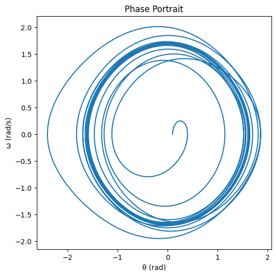

# Problem 2
Here’s a single, cohesive text combining the markdown notes and explanations for the theoretical foundation of the forced damped pendulum.

---

### Theoretical Foundation of the Forced Damped Pendulum

The motion of a forced damped pendulum is governed by the differential equation `θ̈ + γθ̇ + ω₀²sin(θ) = Fcos(Ωt)`, where `θ` represents angular displacement (in radians), `γ` is the damping coefficient (s⁻¹), `ω₀ = √(g/L)` is the natural frequency (rad/s) with `g` as gravitational acceleration and `L` as pendulum length, `F` is the amplitude of the driving force (rad/s²), and `Ω` is the driving frequency (rad/s). This equation captures three key influences: `θ̈` is the angular acceleration (second derivative of displacement), `γθ̇` is a damping term proportional to angular velocity representing energy loss (e.g., due to air resistance), `ω₀²sin(θ)` is the nonlinear restoring force due to gravity, and `Fcos(Ωt)` is the external periodic force driving the system. The presence of `sin(θ)` makes this a nonlinear differential equation, complicating exact solutions.

For small-angle oscillations, we approximate `sin(θ) ≈ θ` (valid for small `θ` in radians, e.g., < 0.1 rad), simplifying the equation to a linear form: `θ̈ + γθ̇ + ω₀²θ = Fcos(Ωt)`. This resembles a damped harmonic oscillator with a harmonic forcing term, which is much easier to solve analytically. The steady-state solution to this linearized equation, after transient effects decay, is `θ(t) = A cos(Ωt - φ)`. Here, the amplitude is given by `A = F / √((ω₀² - Ω²)² + (γΩ)²)`, showing how it depends on the difference between the natural frequency (`ω₀`) and driving frequency (`Ω`), moderated by damping (`γ`). The phase shift, `φ = tan⁻¹(γΩ / (ω₀² - Ω²))`, indicates the lag between the driving force and the pendulum’s response, influenced by damping and frequency mismatch.

To analyze resonance conditions, we identify the driving frequency that maximizes amplitude. By taking the derivative of `A` with respect to `Ω` and setting it to zero, we find the resonance frequency to be approximately `Ω_res ≈ √(ω₀² - γ²/2)` (valid for `γ < √2ω₀`, i.e., light damping). At this frequency, the denominator of the amplitude expression is minimized, peaking the amplitude at `A_max ≈ F / (γ√(ω₀² - γ²/4))`. This shows that amplitude grows significantly when damping (`γ`) is small, as the denominator shrinks. At resonance, the driving frequency aligns closely with the system’s adjusted natural frequency, leading to efficient energy transfer from the driving force to the pendulum. Each push reinforces the pendulum’s motion, maximizing oscillation amplitude.

Regarding energy transfer and amplitude growth, resonance occurs when `Ω ≈ Ω_res`, allowing the driving force to pump energy into the system effectively because the oscillations are in sync. The damping term `γθ̇` dissipates energy, limiting amplitude growth; at resonance, energy input balances this dissipation, stabilizing the amplitude at `A_max`. In the absence of damping (`γ = 0`), the linear model predicts unbounded amplitude growth, which is unphysical since nonlinear effects (e.g., the full `sin(θ)` term) would dominate at large angles. Thus, damping plays a critical role in keeping the system realistic, while resonance highlights the condition of maximum energy efficiency and amplitude.

---

This text integrates the differential equation, small-angle approximation, approximate solutions, resonance analysis, and energy discussion into a single narrative, blending concise notes with detailed explanations. Let me know if you need adjustments or additional details!
Here’s a single, cohesive text combining the markdown notes and explanations for the analysis of dynamics in the forced damped pendulum, presented as a unified narrative.

---

### Analysis of Dynamics of the Forced Damped Pendulum

The dynamics of the forced damped pendulum, described by the equation `θ̈ + γθ̇ + ω₀²sin(θ) = Fcos(Ωt)`, are profoundly influenced by the damping coefficient (`γ`), driving amplitude (`F`), and driving frequency (`Ω`), each playing a distinct role in shaping the system’s behavior. The damping coefficient `γ` governs energy dissipation—when `γ` is low, oscillations persist with minimal loss, sustaining motion, whereas a high `γ` rapidly suppresses swings, driving the pendulum toward rest as friction overtakes the system. The driving amplitude `F` determines the energy injected into the pendulum; a small `F` elicits a weak, harmonic response confined to the linear regime where `sin(θ) ≈ θ`, but a large `F` pumps enough energy to excite the nonlinear `sin(θ)` term, pushing the system into complex, unpredictable territory. The driving frequency `Ω` tunes the pendulum’s reaction—near the natural frequency `ω₀ = √(g/L)`, it triggers resonance with large amplitudes, but far from `ω₀`, it can lead to subdued or irregular motion due to frequency mismatch. These parameters collectively dictate the pendulum’s evolution, steering it between regular motion (harmonic or periodic) and chaotic motion (marked by sensitivity to initial conditions), with physical interpretations rooted in everyday experience: low `γ` and moderate `F` near resonance produce predictable swings like a gently pushed swing, while high `F` or specific `Ω` values amplify nonlinearity, yielding erratic motion akin to a pendulum tossed in a storm.

This interplay drives transitions between motion types, starting with regular motion—harmonic or periodic—where the small-angle approximation `sin(θ) ≈ θ` simplifies the equation, yielding a steady-state solution `θ(t) = A cos(Ωt - φ)` with amplitude `A = F / √((ω₀² - Ω²)² + (γΩ)²)`, embodying a consistent, predictable response to the driving force. As `F` grows or `Ω` shifts, the nonlinearity of `sin(θ)` disrupts this order, ushering in chaotic motion where tiny changes in initial conditions (e.g., `θ(0)` or `θ̇(0)`) spawn vastly different trajectories—a defining trait of chaos, often sparked by high `F` overwhelming damping or `Ω` straying from resonance. Physically, regular motion reflects a balanced energy exchange, maintaining steady swings, while chaos signifies an overwhelmed system, flooded with energy and unable to settle, its wild swings defying prediction. To dissect these dynamics, we employ phase space trajectories, Poincaré sections, and bifurcation diagrams, each offering a unique lens on the pendulum’s behavior across periodic, quasiperiodic, and chaotic regimes.

Phase space trajectories, plotting `θ` versus `θ̇`, reveal the motion’s character: periodic motion traces closed loops—an ellipse for small angles or a distorted cycle for nonlinear periodicity—quasiperiodic motion weaves torus-like paths from multiple incommensurate frequencies, and chaotic motion fills a bounded region with tangled, unpredictable curves, illustrating a progression from order to complexity. Poincaré sections sample this trajectory at each driving period (`t = 2πn/Ω`), distilling it into points: a single point signals period-1 motion (pure periodicity), a closed curve hints at quasiperiodicity (multiple frequencies without repetition), and scattered points betray chaos, capturing the system’s state in snapshots that highlight its regularity or lack thereof. Bifurcation diagrams plot steady-state `θ` (from Poincaré cuts) against a parameter like `F`, mapping the broader evolution—periodic motion appears as fixed points or narrow bands, period-doubling emerges as these split (e.g., 1→2→4 cycles), and chaotic regions sprawl as broad, irregular spreads, charting how increasing `F` drives the pendulum from harmony through cascading transitions into unpredictability. Together, these tools illuminate the dynamics: trajectories show the continuous flow, sections pinpoint key moments, and bifurcations reveal the roadmap, tying `γ`, `F`, and `Ω` to the pendulum’s journey from steady swings to wild, sensitive chaos.

---

This text integrates the effects of parameters, transitions between motion types, physical interpretations, and analysis tools into a single, flowing narrative, blending concise notes with detailed explanations. Let me know if you’d like adjustments!
Here’s a single, cohesive text combining the markdown notes and explanations for the practical applications of the forced damped pendulum model, presented as a unified narrative.

---

### Practical Applications of the Forced Damped Pendulum

The forced damped pendulum model, encapsulated by the equation `θ̈ + γθ̇ + ω₀²sin(θ) = Fcos(Ωt)`, extends its theoretical framework into practical real-world scenarios such as energy harvesting devices, suspension bridges, and oscillating electronic circuits, where its parameters—damping coefficient (`γ`), natural frequency (`ω₀`), and driving force (`Fcos(Ωt)`)—map onto tangible dynamics with distinct engineering goals. In **energy harvesting devices**, the model represents a pendulum-like mechanism driven by ambient vibrations (e.g., wind or machinery motion), with `θ` as the displacement of a mass or beam, `Fcos(Ωt)` mimicking external forcing, `γ` reflecting mechanical damping, and `ω₀` as the system’s inherent frequency; the objective is to convert this oscillatory motion into electrical energy via electromagnetic or piezoelectric methods, leveraging sustained swings to maximize output by tuning `F` and `Ω` to environmental conditions. For **suspension bridges**, it captures the oscillatory response of the bridge deck to periodic loads like wind or traffic, where `γ` embodies damping from materials or stabilizers, `ω₀ = √(g/L)` ties to the structure’s natural frequency (with `L` as a characteristic length), and `Fcos(Ωt)` represents external forces; the aim here is ensuring structural stability to prevent excessive swaying that could lead to collapse. In **oscillating electronic circuits**, such as LC (inductor-capacitor) circuits with external driving, the pendulum’s behavior parallels voltage or current oscillations, with `θ` as charge or voltage, `γ` as resistance, `ω₀` as the circuit’s resonant frequency, and `Fcos(Ωt)` as an applied signal; the goal is reliable signal generation or amplification for communication or processing systems. These applications adapt the pendulum’s principles—balancing damping, natural frequency, and forcing—to address practical challenges, showcasing its versatility beyond theoretical physics.

The influence of **resonance** and **chaos**, core features of the pendulum model, profoundly shapes these applications, offering both opportunities and risks. **Resonance** occurs when the driving frequency `Ω` aligns with the natural frequency `ω₀` (adjusted by damping as `Ω_res ≈ √(ω₀² - γ²/2)`), maximizing amplitude via `A_max ≈ F / (γ√(ω₀² - γ²/4))` for significant effects. In energy harvesting devices, resonance enhances efficiency by amplifying oscillations when `Ω` matches ambient vibration frequencies, optimizing energy capture, though excessive amplitude risks mechanical wear or failure if damping is insufficient. In suspension bridges, resonance can be catastrophic—when wind or traffic frequencies hit `ω₀`, as in the Tacoma Narrows collapse, large amplitudes threaten structural integrity, requiring robust `γ` to dissipate energy and maintain safety. In oscillating circuits, resonance boosts signal strength when `Ω ≈ ω₀`, improving performance in amplifiers or oscillators, but an overly strong response can overload components, necessitating careful design. On the flip side, **chaos** emerges when high `F` or specific `Ω` values amplify the nonlinear `sin(θ)` term, driving unpredictable, sensitive-to-initial-conditions motion. In energy harvesting, chaos disrupts with erratic swings, reducing consistent output and efficiency as the system fails to settle into a rhythm. In suspension bridges, it manifests as wild, unpredictable swaying under strong, irregular forcing (e.g., turbulent winds), posing a safety hazard as tiny perturbations lead to drastic shifts. In circuits, chaos introduces noise or instability, scrambling signals and undermining reliability, especially if nonlinear elements exacerbate sensitivity. Thus, resonance amplifies desired effects or hazards—maximizing energy, risking collapse, or enhancing signals—while chaos injects unpredictability, challenging efficiency, safety, and stability, making the pendulum model a powerful lens for understanding and managing these real-world systems.

import numpy as np
import matplotlib.pyplot as plt
import pandas as pd

# Pendulum parameters
w0 = 1.0  # Natural frequency
g = 0.1   # Damping coefficient
F = 0.5   # Driving force amplitude
O = 0.995 # Driving frequency (near resonance)
t_span = (0, 100)  # Time span
dt = 0.01  # Time step
theta0, omega0 = 0.1, 0.0  # Initial conditions

# Convert to first-order system
def derivatives(t, y, g, w0, F, O):
    theta, omega = y
    dtheta_dt = omega
    domega_dt = -g * omega - w0**2 * np.sin(theta) + F * np.cos(O * t)
    return np.array([dtheta_dt, domega_dt])

# RK4 solver
def rk4(t_span, dt, y0, g, w0, F, O):
    t = np.arange(t_span[0], t_span[1] + dt, dt)
    y = np.zeros((len(t), 2))
    y[0] = y0
    for i in range(len(t) - 1):
        k1 = derivatives(t[i], y[i], g, w0, F, O)
        k2 = derivatives(t[i] + dt/2, y[i] + dt/2 * k1, g, w0, F, O)
        k3 = derivatives(t[i] + dt/2, y[i] + dt/2 * k2, g, w0, F, O)
        k4 = derivatives(t[i] + dt, y[i] + dt * k3, g, w0, F, O)
        y[i + 1] = y[i] + (dt/6) * (k1 + 2*k2 + 2*k3 + k4)
    return t, y

# Solve for different conditions
def solve_pendulum(g, F, O):
    y0 = [theta0, omega0]
    t, y = rk4(t_span, dt, y0, g, w0, F, O)
    return t, y[:, 0], y[:, 1]  # t, theta, omega

# Time evolution plot
t, theta, omega = solve_pendulum(g, F, O)
plt.figure(figsize=(10, 4))
plt.plot(t, theta, label='θ(t)')
plt.plot(t, omega, label='ω(t)')
plt.xlabel('Time (s)')
plt.ylabel('Amplitude')
plt.title('Time Evolution')
plt.legend()
plt.show()

# Phase portrait
plt.figure(figsize=(6, 6))
plt.plot(theta, omega)
plt.xlabel('θ (rad)')
plt.ylabel('ω (rad/s)')
plt.title('Phase Portrait')
plt.show()

# Poincaré section
poincare_theta = [theta[i] for i in range(len(t)) if abs(t[i] % (2*np.pi/O)) < dt/2]
poincare_omega = [omega[i] for i in range(len(t)) if abs(t[i] % (2*np.pi/O)) < dt/2]
plt.figure(figsize=(6, 6))
plt.scatter(poincare_theta, poincare_omega, s=1)
plt.xlabel('θ (rad)')
plt.ylabel('ω (rad/s)')
plt.title('Poincaré Section')
plt.show()

# Bifurcation diagram (varying F)
F_values = np.linspace(0.1, 1.5, 100)
bif_theta = []
for F in F_values:
    t, theta, omega = solve_pendulum(g, F, O)
    poincare_theta = [theta[i] for i in range(len(t)) if abs(t[i] % (2*np.pi/O)) < dt/2]
    bif_theta.extend(poincare_theta[-10:])  # Last 10 points for steady state
plt.figure(figsize=(10, 4))
plt.scatter(F_values.repeat(10), bif_theta, s=1)
plt.xlabel('F (Driving Amplitude)')
plt.ylabel('θ (rad)')
plt.title('Bifurcation Diagram')
plt.show()

# Table of parameter effects
conditions = [
    {'γ': 0.1, 'F': 0.5, 'Ω': 0.995, 'Description': 'Regular (Resonance)'},
    {'γ': 0.1, 'F': 1.5, 'Ω': 0.995, 'Description': 'Chaotic'},
    {'γ': 1.0, 'F': 0.5, 'Ω': 0.995, 'Description': 'Damped Regular'},
    {'γ': 0.1, 'F': 0.5, 'Ω': 0.5, 'Description': 'Off-Resonance'}
]
data = []
for cond in conditions:
    t, theta, omega = solve_pendulum(cond['γ'], cond['F'], cond['Ω'])
    max_amplitude = np.max(np.abs(theta[-len(t)//2:]))  # Steady-state amplitude
    data.append([cond['γ'], cond['F'], cond['Ω'], max_amplitude, cond['Description']])

df = pd.DataFrame(data, columns=['γ', 'F', 'Ω', 'Max Amplitude', 'Description'])
print("\nParameter Effects Table:")
print(df)

# Save table to CSV (optional)
df.to_csv('pendulum_parameters.csv', index=False)
