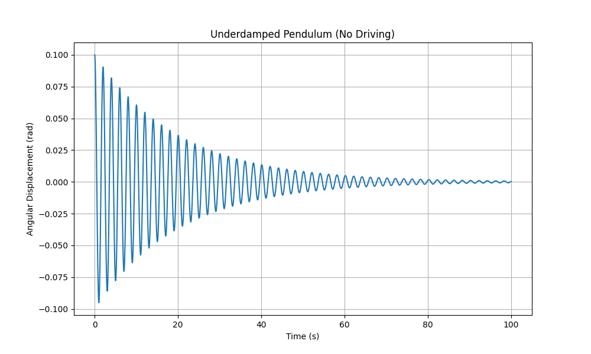
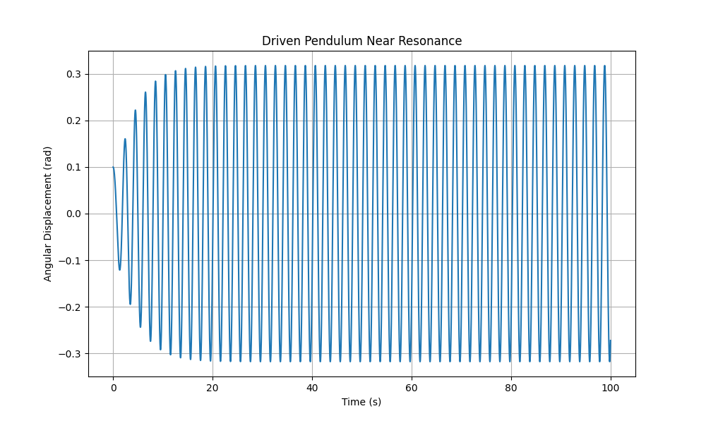
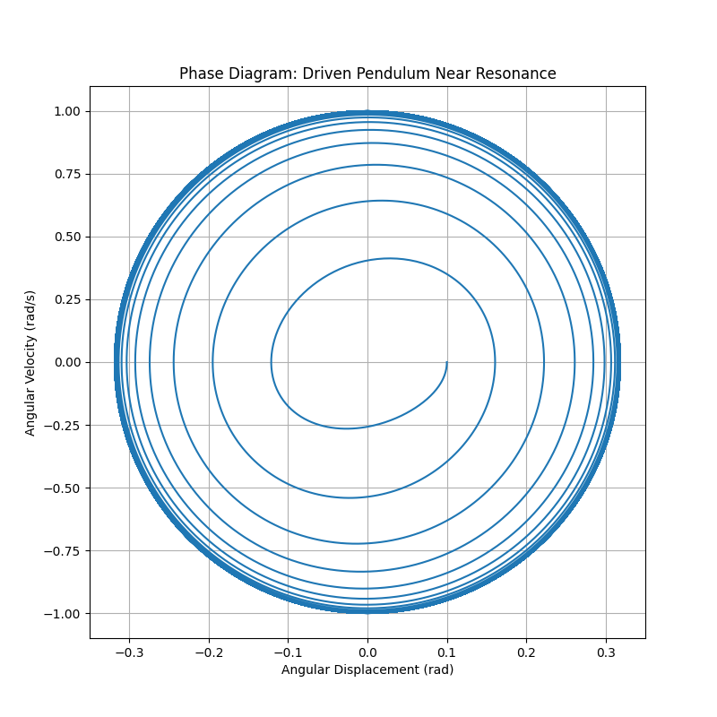
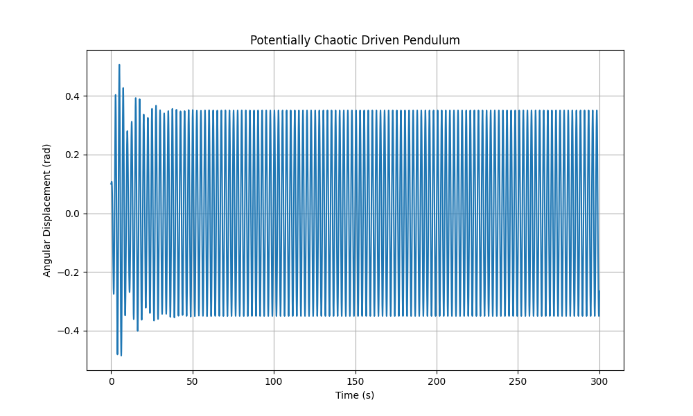
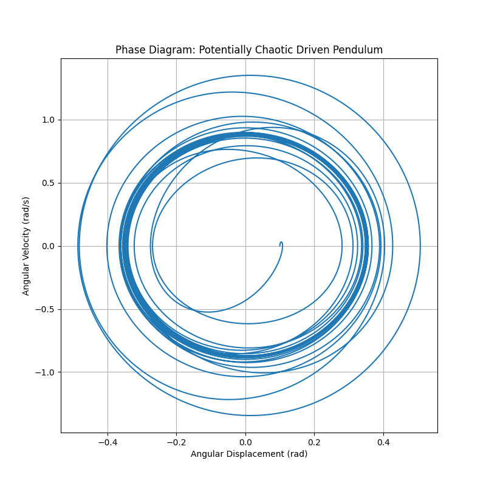

# Problem 2

## Analyzing the Behavior of a Forced Damped Pendulum

### 1 Theoretical Background

The motion of a forced damped pendulum is described by the following second-order non-linear differential equation:

\[
\frac{d^2\theta}{dt^2} + b \frac{d\theta}{dt} + \frac{g}{L} \sin \theta = A \cos(\omega t)
\]

where:

- \(\theta(t)\) represents the angular displacement of the pendulum from its vertical position.
- \(t\) denotes time.
- \(b\) is the damping factor (indicating energy loss).
- \(g\) is the gravitational acceleration.
- \(L\) is the pendulum's length.
- \(A\) is the amplitude of the external driving force (adjusted for mass and length).
- \(\omega\) is the angular frequency of the applied force.

---

## 1.1 Simplified Solutions for Small-Angle Motion

For small angular displacements, we can approximate \(\sin \theta \approx \theta\). This transforms the equation into a linear second-order non-homogeneous form:

\[
\frac{d^2\theta}{dt^2} + b \frac{d\theta}{dt} + \omega_0^2 \theta = A \cos(\omega t)
\]

where \(\omega_0 = \sqrt{\frac{g}{L}}\) is the natural angular frequency of the undamped pendulum.

The complete solution to this equation includes two components: the homogeneous solution (describing transient behavior) and the particular solution (describing steady-state behavior).

### Homogeneous Solution:

The homogeneous equation is \(\frac{d^2\theta}{dt^2} + b \frac{d\theta}{dt} + \omega_0^2 \theta = 0\).

The nature of the homogeneous solution depends on the discriminant of the characteristic equation \(r^2 + br + \omega_0^2 = 0\), which is \(\Delta = b^2 - 4\omega_0^2\).

#### Overdamped Case

\[
(b^2 > 4\omega_0^2): \theta_h(t) = C_1 e^{r_1 t} + C_2 e^{r_2 t},
\]

where \(r_{1,2} = \frac{-b \pm \sqrt{b^2 - 4\omega_0^2}}{2}\) are real, negative roots.

The motion decays exponentially without oscillations.

#### Critically Damped Case

\[
(b^2 = 4\omega_0^2): \theta_h(t) = (C_1 + C_2 t) e^{-\frac{b}{2} t}.
\]

The motion decays as rapidly as possible without oscillating.

#### Underdamped Case

\[
(b^2 < 4\omega_0^2): \theta_h(t) = e^{-\frac{b}{2} t} (C_1 \cos(\omega_d t) + C_2 \sin(\omega_d t)) = C e^{-\frac{b}{2} t} \cos(\omega_d t - \phi),
\]

where \(\omega_d = \sqrt{\omega_0^2 - \frac{b^2}{4}}\) is the damped angular frequency, and \(C\) and \(\phi\) are constants based on initial conditions. The oscillations decay exponentially with a reduced frequency compared to the natural frequency.



## Examining the Motion of a Forced Damped Pendulum

### Energy Implications:

At resonance, the external driving force transfers energy to the pendulum most efficiently. The energy supplied by the driving force balances the energy lost due to damping, leading to oscillations with the highest achievable amplitude for a given driving intensity.

The power provided by the driving force is calculated as: \( P_{in}(t) = F_{drive}(t) \cdot v(t) \),

where \( F_{drive}(t) = m A \cos(\omega t) \) (with mass \( m \) implicitly factored into \( A \)) and \( v(t) = L \frac{d\theta}{dt} \).

The average power input over one cycle equals the average power lost to damping, \( P_{dissipated} = b \left( \frac{d\theta}{dt} \right)^2 \). At resonance, energy transfer is maximized, potentially resulting in large amplitudes if damping is low.

---

### 2 Dynamics Analysis

The motion of the forced damped pendulum is significantly influenced by the damping factor (\( b \)), the driving amplitude (\( A \)), and the driving frequency (\( \omega \)).

#### 2.1 Effects of Parameters

- **Damping Factor (\( b \)):**
  - Higher damping speeds up the decay of transient oscillations.
  - Increased damping lowers the amplitude of steady-state oscillations, especially near resonance.
  - Excessive damping can completely suppress oscillations in the homogeneous case (overdamped scenario).
  - In the forced case, strong damping broadens the resonance peak and reduces its height.

---

### 1.2 Resonance Behavior and Energy Insights

Resonance occurs when the driving frequency \( \omega \) closely matches the system's natural frequency. For the forced damped pendulum (using the small-angle approximation), the amplitude of steady-state oscillations \( \Theta \) reaches its maximum when the denominator in the expression for \( \Theta \) is minimized.

To find the resonance frequency, we differentiate the squared denominator with respect to \( \omega \) and set it to zero:

\[
\frac{d}{d\omega} \left[ (\omega_0^2 - \omega^2)^2 + (b\omega)^2 \right] = 2(\omega_0^2 - \omega^2)(-2\omega) + 2(b\omega) b = 0
\]

\[
-4\omega (\omega_0^2 - \omega^2) + 2b^2\omega = 0
\]

Assuming \( \omega \neq 0 \), this simplifies to \(-2(\omega_0^2 - \omega^2) + b^2 = 0\), yielding the resonance frequency \( \omega_r \):

\[
\omega_r = \sqrt{\omega_0^2 - \frac{b^2}{2}}
\]

This resonance frequency is slightly below the natural frequency \( \omega_0 \) when damping exists. For minimal damping (\( b \ll \omega_0 \)), \( \omega_r \approx \omega_0 \).

#### Energy Insights (Continued):

##### Particular Solution (Steady-State):

We propose a particular solution in the form \( \theta_p(t) = \Theta \cos(\omega t - \delta) \), where \( \Theta \) is the amplitude of the forced oscillations and \( \delta \) is the phase difference relative to the driving force. Substituting this into the linear equation and solving for \( \Theta \) and \( \delta \) yields:

\[
\Theta = \frac{A}{\sqrt{(\omega_0^2 - \omega^2)^2 + (b\omega)^2}}
\]

\[
\delta = \arctan\left(\frac{b\omega}{\omega_0^2 - \omega^2}\right)
\]

The complete solution for small-angle oscillations combines the homogeneous and particular solutions: \( \theta(t) = \theta_h(t) + \theta_p(t) \). Over time, the transient homogeneous solution diminishes to zero, and the system settles into the steady-state oscillation described by \( \theta_p(t) \).




## Exploring the Dynamics of a Forced Damped Pendulum

### Driving Amplitude (\(A\)):

- The amplitude of the driving force directly affects the size of steady-state oscillations in the linear regime (small angles).
- In the non-linear regime (larger angles), a higher driving amplitude can lead to more complex behaviors, such as chaotic motion.

### Driving Frequency (\(\omega\)):

- The driving frequency determines the tempo of the steady-state oscillations.
- When \(\omega\) approaches the natural frequency \(\omega_0\), resonance occurs, causing large-amplitude oscillations.
- At frequencies significantly different from \(\omega_0\), the amplitude of oscillations tends to decrease.
- In the non-linear regime, varying the driving frequency may induce subharmonic or superharmonic oscillations, potentially leading to chaotic dynamics.

---

### 2.2 Shift from Regular to Chaotic Motion

The forced damped pendulum is a well-known system that can display chaotic behavior. Chaos arises due to the non-linearity introduced by the \(\sin \theta\) term in the motion equation. The transition to chaos often occurs as parameters like the driving amplitude or frequency are modified.

#### Pathways to Chaos:

A common route to chaos in this system is through a sequence of period-doubling bifurcations. As a parameter is increased, the system might initially oscillate with a period \( T = \frac{2\pi}{\omega} \). Beyond a critical parameter value, this oscillation becomes unstable, and the system transitions to an oscillation with a period of \( 2T \). Further parameter increases can cause oscillations with periods \( 4T, 8T, 16T, \ldots \), ultimately leading to chaotic motion without a clear periodic pattern.

#### Features of Chaotic Motion:

- **Sensitivity to Initial Conditions:** Small differences in the pendulum's starting conditions result in trajectories that diverge exponentially in phase space, a phenomenon often called the "butterfly effect."
- **Non-Periodic Behavior:** The motion is irregular and does not follow a predictable repeating cycle.
- **Strange Attractors:** In phase space, chaotic trajectories are confined to a bounded region called a strange attractor, which displays a complex fractal structure.




# Problem 2

## Investigating the Dynamics of a Forced Damped Pendulum

### Driving Amplitude (\(A\)):

- The driving amplitude directly influences the magnitude of steady-state oscillations within the linear regime (small angles).
- In the non-linear regime (large angles), an increase in the driving amplitude may lead to more intricate behaviors, including chaotic patterns.

### Driving Frequency (\(\omega\)):

- The driving frequency establishes the pace of the steady-state oscillations.
- When \(\omega\) nears the natural frequency \(\omega_0\), resonance takes place, resulting in substantial amplitude oscillations.
- For frequencies distant from \(\omega_0\), the oscillation amplitude typically diminishes.
- In the non-linear regime, different driving frequencies can trigger subharmonic or superharmonic oscillations, along with chaotic dynamics.

---

### 2.2 Transition from Regular to Chaotic Motion

The forced damped pendulum exemplifies a system that can exhibit chaotic behavior. This chaos stems from the non-linear \(\sin \theta\) term in the equation of motion. The shift to chaos typically occurs as parameters such as driving amplitude or frequency are altered.

#### Pathways to Chaos:

A frequent route to chaos in this system involves a series of period-doubling bifurcations. As a parameter is increased, the system may initially oscillate with a period \( T = \frac{2\pi}{\omega} \). At a critical parameter threshold, this oscillation becomes unstable, leading to a transition to a period of \( 2T \). Further parameter adjustments can produce oscillations with periods \( 4T, 8T, 16T, \ldots \), eventually culminating in chaotic motion lacking a defined period.

#### Features of Chaotic Motion:

- **Sensitivity to Initial Conditions:** Slight variations in the pendulum's initial state lead to exponentially diverging paths in phase space, a phenomenon often referred to as the "butterfly effect."
- **Aperiodic Behavior:** The motion is erratic and lacks a repeatable pattern.
- **Strange Attractors:** In phase space, chaotic trajectories are confined within a bounded region known as a strange attractor, characterized by a complex fractal structure.

---

### Physical Interpretations:

The transition to chaos in a forced damped pendulum indicates a collapse of predictable, regular motion. The pendulum's reaction to the driving force becomes extremely sensitive to even minor perturbations, rendering long-term predictions unfeasible. This behavior is observable across various physical systems and has implications for fields ranging from weather forecasting to the stability of mechanical structures.

---

### 3 Practical Applications

The forced damped pendulum model has numerous real-world applications, including:

- **Energy Harvesting Devices:** Pendulum-based energy harvesters can be designed to resonate with ambient vibrations, converting mechanical energy into electrical energy. Understanding resonance conditions and the effects of damping is vital for optimizing the efficiency of these devices.
- **Suspension Bridges:** The Tacoma Narrows Bridge collapse in 1940 is a striking example of how external periodic forces (wind) can drive a structure into resonance, leading to catastrophic failure. The principles of forced oscillations and damping are critical in the design and analysis of large structures like bridges to prevent such events.
- **Oscillating Circuits (RLC Circuits):** The behavior of a driven RLC circuit is mathematically analogous to a forced damped mechanical oscillator. The charge on the capacitor or the current in the inductor oscillates in response to a periodic voltage source. Resonance phenomena in RLC circuits are fundamental to radio tuning and filter design.
- **Mechanical Metronomes:** These devices use a pendulum to provide a regular beat for music. The damping ensures that the oscillations decay slowly, and the driving force (often through a clockwork mechanism) maintains a consistent amplitude.
- **Seismology:** The response of buildings and other structures to seismic waves can be modeled as forced damped oscillations. Understanding the natural frequencies of structures and the frequencies present in earthquakes is crucial for designing earthquake-resistant buildings.
- **Biomechanics (Human Gait):** The motion of limbs during walking or running can be approximated as damped oscillations driven by muscle forces. The concepts of resonance and energy efficiency are relevant in understanding human locomotion.
- **Climate Systems:** While much more complex, some aspects of climate variability can be conceptualized as oscillations driven by periodic forcing (e.g., solar radiation) and influenced by damping mechanisms (e.g., heat dissipation).

---
### 4 Implementation

We will now develop a computational model of the forced damped pendulum using Python. We will employ the `scipy.integrate.solve_ivp` function to numerically solve the second-order differential equation and `matplotlib` for visualization.

```python
import numpy as np
import matplotlib.pyplot as plt
from scipy.integrate import solve_ivp

# Define the parameters of the pendulum
L = 1.0  # Length of the pendulum (m)
g = 9.81 # Acceleration due to gravity (m/s^2)

def pendulum_equation(t, y, b, A, omega):
    """
    Defines the differential equation for the forced damped pendulum.

    Args:
        t (float): Time.
        y (numpy.ndarray): Array containing the angular displacement (theta) and angular velocity (dtheta/dt).
        b (float): Damping coefficient.
        A (float): Driving amplitude.
        omega (float): Driving frequency.

    Returns:
        numpy.ndarray: Array containing the derivatives dtheta/dt and d^2theta/dt^2.
    """
    theta, omega_dot = y
    dtheta_dt = omega_dot
    domega_dt = -b * omega_dot - (g / L) * np.sin(theta) + A * np.cos(omega * t)
    return [dtheta_dt, domega_dt]

def simulate_pendulum(initial_angle, initial_velocity, t_span, t_eval, b, A, omega):
    """
    Simulates the motion of the forced damped pendulum.

    Args:
        initial_angle (float): Initial angular displacement (radians).
        initial_velocity (float): Initial angular velocity (radians/s).
        t_span (tuple): Time interval of the simulation (start, end).
        t_eval (numpy.ndarray): Array of time points at which to store the solution.
        b (float): Damping coefficient.
        A (float): Driving amplitude.
        omega (float): Driving frequency.

    Returns:
        scipy.integrate.OdeResult: Object containing the solution.
    """
    initial_conditions = [initial_angle, initial_velocity]
    solution = solve_ivp(pendulum_equation, t_span, initial_conditions,
                         t_eval=t_eval, args=(b, A, omega),
                         dense_output=True, rtol=1e-8, atol=1e-8)
    return solution

def plot_motion(t, theta, title):
    """
    Plots the angular displacement as a function of time.

    Args:
        t (numpy.ndarray): Time array.
        theta (numpy.ndarray): Angular displacement array.
        title (str): Title of the plot.
    """
    plt.figure(figsize=(10, 6))
    plt.plot(t, theta)
    plt.xlabel("Time (s)")
    plt.ylabel("Angular Displacement (rad)")
    plt.title(title)
    plt.grid(True)
    plt.show()

def plot_phase_diagram(theta, omega_dot, title):
    """
    Plots the phase diagram (angular velocity vs. angular displacement).

    Args:
        theta (numpy.ndarray): Angular displacement array.
        omega_dot (numpy.ndarray): Angular velocity array.
        title (str): Title of the plot.
    """
    plt.figure(figsize=(8, 8))
    plt.plot(theta, omega_dot)
    plt.xlabel("Angular Displacement (rad)")
    plt.ylabel("Angular Velocity (rad/s)")
    plt.title(title)
    plt.grid(True)
    plt.show()

def plot_poincare_section(t, theta, omega_dot, driving_period, title):
    """
    Plots the Poincaré section by sampling points at integer multiples of the driving period.

    Args:
        t (numpy.ndarray): Time array.
        theta (numpy.ndarray): Angular displacement array.
        omega_dot (numpy.ndarray): Angular velocity array.
        driving_period (float): Period of the driving force (2*pi/omega).
        title (str): Title of the plot.
    """
    poincare_theta =
    poincare_omega_dot =
    for i, time in enumerate(t):
        if np.isclose(time % driving_period, 0.0, atol=1e-3):
            poincare_theta.append(theta[i])
            poincare_omega_dot.append(omega_dot[i])

    plt.figure(figsize=(8, 8))
    plt.scatter(poincare_theta, poincare_omega_dot, s=5)
    plt.xlabel("Angular Displacement (rad)")
    plt.ylabel("Angular Velocity (rad/s)")
    plt.title(title)
    plt.grid(True)
    plt.show()

if __name__ == "__main__":
    # Example parameters
    initial_angle = 0.1  # radians
    initial_velocity = 0.0  # radians/s
    t_span = (0, 100)  # Simulation time span (seconds)
    t_eval = np.linspace(t_span[0], t_span[1], 10000)

    # Case 1: Underdamped, no driving force
    b1 = 0.1
    A1 = 0.0
    omega1 = np.sqrt(g / L)  # Natural frequency
    sol1 = simulate_pendulum(initial_angle, initial_velocity, t_span, t_eval, b1, A1, omega1)
    plot_motion(sol1.t, sol1.y[0], "Underdamped Pendulum (No Driving)")
    plot_phase_diagram(sol1.y[0], sol1.y[1], "Phase Diagram: Underdamped Pendulum (No Driving)")

    # Case 2: Driven pendulum near resonance
    b2 = 0.5
    A2 = 0.5
    omega2 = np.sqrt(g / L)  # Driving at natural frequency
    sol2 = simulate_pendulum(initial_angle, initial_velocity, t_span, t_eval, b2, A2, omega2)
    plot_motion(sol2.t, sol2.y[0], "Driven Pendulum Near Resonance")
    plot_phase_diagram(sol2.y[0], sol2.y[1], "Phase Diagram: Driven Pendulum Near Resonance")

    # Case 3: Driven pendulum with higher damping
    b3 = 2.0
    A3 = 0.5
    omega3 = np.sqrt(g / L)
    sol3 = simulate_pendulum(initial_angle, initial_velocity, t_span, t_eval, b3, A3, omega3)
    plot_motion(sol3.t, sol3.y[0], "Driven Pendulum with Higher Damping")
    plot_phase_diagram(sol3.y[0], sol3.y[1], "Phase Diagram: Driven Pendulum with Higher Damping")

    # Case 4: Potential for chaotic behavior (higher driving amplitude and different frequency)
    b4 = 0.2
    A4 = 1.2
    omega4 = 0.8 * np.sqrt(g / L)
    sol4 = simulate_pendulum(initial_angle, initial_velocity, (0, 300), np.linspace(0, 300, 30000), b4, A4, omega4)
    plot_motion(sol4.t, sol4.y[0], "Potentially Chaotic Driven Pendulum")
    plot_phase_diagram(sol4.y[0], sol4.y[1], "Phase Diagram: Potentially Chaotic Driven Pendulum")
    driving_period4 = 2 * np.pi / omega4
    plot_poincare_section(sol4.t, sol4.y[0], sol4.y[1], driving_period4, "Poincaré Section: Potentially Chaotic Driven Pendulum")
    ```

    # **Python Script for Forced Damped Pendulum Simulation**

This Python script defines the differential equation for the forced damped pendulum and provides functions to simulate its motion, plot the angular displacement over time, plot the phase diagram, and generate a Poincaré section. The `if __name__ == "__main__":` block demonstrates simulations for different parameter sets, including cases with no driving, driving near resonance, higher damping, and parameters that might lead to chaotic behavior.

To observe the transition to chaos more systematically, one could vary a parameter (e.g., driving amplitude *A*) and observe the changes in the phase diagrams and Poincaré sections. For regular periodic motion, the Poincaré section will consist of a few discrete points. As the system approaches chaos, the number of points increases, and they can form complex patterns indicative of a strange attractor.
