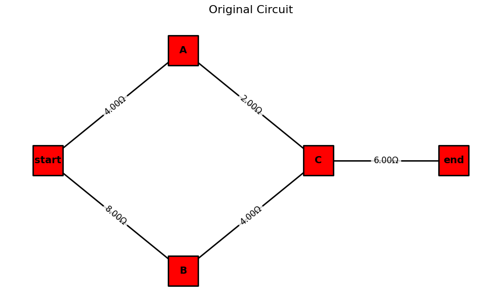
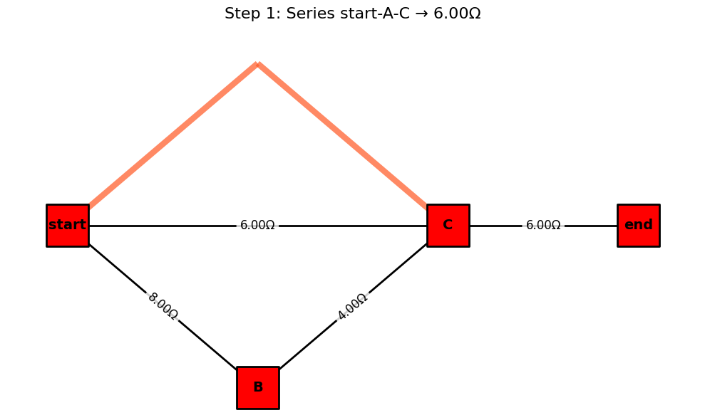
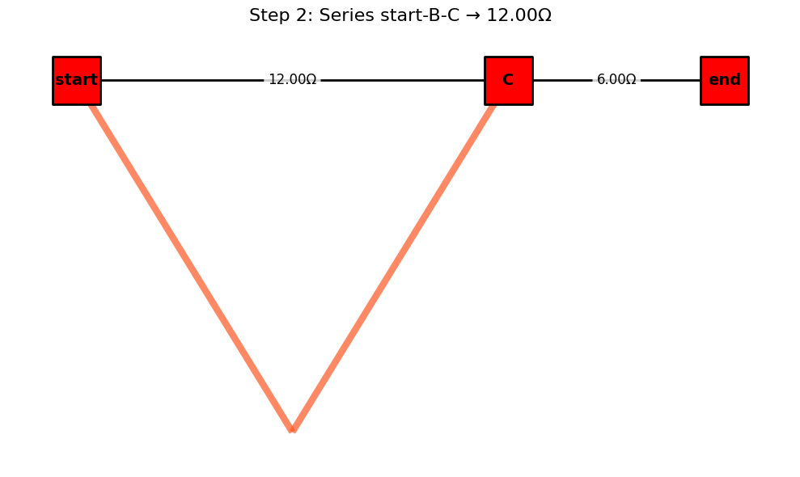
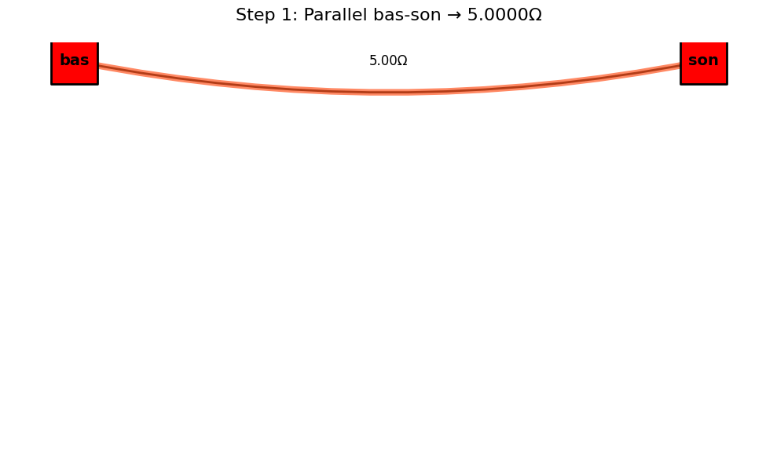

# Problem 1
## Equivalent Resistance Using Graph Theory

### Introduction and Motivation

Calculating equivalent resistance is a fundamental task in circuit analysis. While traditional approaches use series and parallel simplification rules manually, graph theory provides a powerful alternative – transforming circuit analysis into an algorithmic graph simplification process.

Circuits can be represented as graphs: - Nodes = junctions - Edges = resistors (with resistance as weight)

By identifying series and parallel patterns in the graph, we can iteratively reduce it to compute total resistance between two terminals.

This approach is: - Scalable for large networks - Automatable for software - Insightful for understanding electrical connectivity and topology
# Learning Goals

After completing this task, you should be able to:

- Represent a resistor network as a weighted graph.
- Apply reduction rules (series and parallel) using graph algorithms.
- Implement an algorithm that simplifies arbitrary configurations.
- Analyze different circuit structures programmatically.
### Algorithm
The circuit is modeled as a multigraph G = (V, E), where V is the set of junctions (nodes) and E is the set of resistors (edges). Each edge e ∈ E has a weight r_e representing its resistance. Two distinct nodes, `start_node` and `end_node`, are specified as the terminals across which the equivalent resistance is sought.

The algorithm proceeds as follows:

1. **Initialization:**
   - Construct the graph from the given circuit components.
   - Validate that `start_node` and `end_node` exist in the graph. If `start_node` = `end_node`, the resistance is 0Ω.

2. **Iterative Reduction:** Repeatedly apply the following reduction rules until no more simple series or parallel reductions are possible, or the graph is reduced to a single edge between `start_node` and `end_node`.
   - **Parallel Reduction:**
   **Identification:** Find any pair of nodes (u, v) connected by two or more edges (resistors R₁, R₂, ..., R_k).
- **Reduction:** Replace these k parallel resistors with a single equivalent resistor R_p between u and v. The equivalent resistance is calculated as: ( R_p = (Σᵢ₌₁ᵏ 1/R_i)⁻¹ ) if any R_i = 0, R_p = 0. If all R_i = ∞, R_p = ∞.
- **Action:** Remove the original k edges and add a new edge (u, v) with resistance R_p. If R_p = ∞, effectively remove the connection unless it's the only path.
- After a reduction, restart the scan for further simplifications as the graph structure has changed.
### Series Reduction:
- **Identification:** Find any node w such that:
  - w is not the `start_node` or `end_node`.
  - The degree of w, deg(w), is exactly 2. Let the two edges incident to w be (u, w) with resistance R₁, and (w, v) with resistance R₂.
  - Ensure u ≠ v₁ (if u = v, it's a loop, not a simple series element in a path from `start_node` to `end_node`).
- **Reduction:** Replace the two series resistors R₁ and R₂, and the intermediate node w with a single equivalent resistor R_s between u and v. The equivalent resistance is: ( R_s = R₁ + R₂ ) if R₁ = ∞ or R₂ = ∞, then R_s = ∞.
- **Action:** Remove node w (which also removes edges (u, w) and (w, v)). Add a new edge (u, v) with resistance R_s. If R_s = ∞, effectively this path segment becomes an open circuit.
- After a reduction, restart the scan.
- **Reduction:** Replace these k parallel resistors with a single equivalent resistor R_p between u and v. The equivalent resistance is calculated as: ( R_p = (Σᵢ₌₁ᵏ 1/R_i)⁻¹ ) if any R_i = 0, R_p = 0. If all R_i = ∞, R_p = ∞.
- **Action:** Remove the original k edges and add a new edge (u, v) with resistance R_p. If R_p = ∞, effectively remove the connection unless it's the only path.
- After a reduction, restart the scan for further simplifications as the graph structure has changed.
- **Action:** Remove node w (which also removes edges (u, w) and (w, v)). Add a new edge (u, v) with resistance R_s. If R_s = ∞, effectively this path segment becomes an open circuit.
- After a reduction, restart the scan.
### Termination and Result:
- The loop terminates if no series or parallel reductions were made in a full pass.
- **Ideal Case:** If the graph is reduced to a single edge between `start_node` and `end_node`, its resistance is the equivalent resistance.
- **Final Parallel Case:** If the graph consists of only `start_node` and `end_node` and multiple edges directly connecting them, these are in parallel. Calculate their combined parallel resistance.
- **Non-Reducible Case:** If the graph cannot be simplified further by these rules to one of the above states, the circuit may contain non-series-parallel configurations (e.g., a Wheatstone bridge not in balance). The algorithm, in this form, will report that it cannot fully reduce the circuit.
- **Open Circuit:** If, at any point or at the end, there is no path between `start_node` and `end_node`, the equivalent resistance is ∞.
- **Short Circuit:** If an equivalent resistance of 0Ω is found.
# Series Connection

Two resistors R₁ and R₂ in series:
R_eq = R₁ + R₂
# Parallel Connection

Two resistors R₁ and R₂ in parallel:
1/R_eq = 1/R₁ + 1/R₂ => R_eq = (1/R₁ + 1/R₂)⁻¹

### Phyton İmplemntaion
```python
from IPython import get_ipython
from IPython.display import display
import matplotlib.pyplot as plt
import networkx as nx

class ResistorNetworkAnalyzer:
    def __init__(self):
        self.step_count = 0
        self.visualization_steps = []

    def _get_edge_labels(self, G):
        """Helper function to generate edge labels with resistance values"""
        edge_labels = {}
        for u, v, data in G.edges(data=True):
            if 'resistance' in data:
                # Handle MultiGraph key access here as well
                if isinstance(G, nx.MultiGraph) and len(G[u][v]) > 1:
                    # If multiple edges, show all resistances
                    labels = [f"{d.get('resistance', 0):.2f}Ω" for k, d in G[u][v].items()]
                    edge_labels[(u, v)] = ', '.join(labels)
                else:
                    edge_labels[(u, v)] = f"{data['resistance']:.2f}Ω"
            # Removed the redundant elif for MultiGraph, handled above
        return edge_labels

    def draw_circuit(self, G, pos, title, highlight_edges=None):
        """Improved visualization function with better highlighting"""
        plt.figure(figsize=(10, 6))

        # Node styling - Tüm düğümler kırmızı ve kare şeklinde
        node_colors = ['#FF0000' for node in G.nodes()]  # Tüm düğümler için kırmızı renk
        nx.draw_networkx_nodes(G, pos, node_color=node_colors, node_size=1800, 
                             node_shape='s', edgecolors='black', linewidths=2)  # Kare şekil
        nx.draw_networkx_labels(G, pos, font_size=14, font_weight='bold')

        # Draw all edges
        # Need to handle MultiGraph edges explicitly for drawing
        if isinstance(G, nx.MultiGraph):
             # Draw each edge individually for MultiGraphs
            for u, v, key, data in G.edges(keys=True, data=True):
                 # Use connectionstyle to curve parallel edges for better visibility
                 nx.draw_networkx_edges(G, pos, edgelist=[(u,v)], width=2, edge_color='black', connectionstyle='arc3,rad=0.1')
        else:
             nx.draw_networkx_edges(G, pos, width=2, edge_color='black')


        # Highlight edges that were modified
        if highlight_edges:
             # Need to handle MultiGraph highlighting carefully
             if isinstance(G, nx.MultiGraph):
                 highlight_edges_with_keys = []
                 for u, v in highlight_edges:
                     if G.has_edge(u, v):
                         # Highlight all edges between u and v (assuming highlight_edges contains the pairs that were combined)
                         # A more precise highlighting would require knowing the keys of the edges that were removed.
                         # For visualization purposes, highlighting the path between nodes u and v is often sufficient.
                         for key in G[u][v]:
                              highlight_edges_with_keys.append((u, v, key))


                 if highlight_edges_with_keys:
                      nx.draw_networkx_edges(G, pos, edgelist=highlight_edges_with_keys,
                                 edge_color='#FF5722', width=6, alpha=0.7, connectionstyle='arc3,rad=0.1')
             else:
                nx.draw_networkx_edges(G, pos, edgelist=highlight_edges,
                                 edge_color='#FF5722', width=6, alpha=0.7)


        # Edge labels with resistance values
        edge_labels = self._get_edge_labels(G)
        # nx.draw_networkx_edge_labels has issues with MultiGraph parallel edges.
        # It often labels only one of the parallel edges or overlaps labels.
        # A more advanced labeling for MultiGraphs might involve manually positioning labels.
        # For this example, we will keep the standard labeling, but be aware of limitations.
        nx.draw_networkx_edge_labels(G, pos, edge_labels=edge_labels, font_size=12,
                                   bbox=dict(facecolor='white', edgecolor='none',
                                            alpha=0.8, boxstyle='round,pad=0.3'))

        plt.title(title, fontsize=16, pad=20)
        plt.axis('off')
        plt.tight_layout()
        # Check if running in a Jupyter environment before trying to display
        ipython = get_ipython()
        if ipython is not None:
            display(plt.gcf()) # Use display for inline plotting in Jupyter
        else:
            plt.show() # Fallback for non-Jupyter environments
        plt.close() # Close the figure after showing to prevent memory issues


    def combine_series(self, G, pos):
        """Combine series resistors with visualization"""
        changed = True
        while changed:
            changed = False
            for node in list(G.nodes):
                # Exclude terminal nodes and check degree
                # For MultiGraph, degree counts each edge
                if node not in ("start", "end", "bas", "son") and G.degree(node) == 2:
                    neighbors = list(G.neighbors(node))
                    # Ensure there are exactly two distinct neighbors
                    if len(neighbors) == 2 and neighbors[0] != neighbors[1]:
                           u, v = neighbors
                           # In a MultiGraph, need to check if there's only one edge between node and each neighbor
                           if isinstance(G, nx.MultiGraph):
                                if G.number_of_edges(node, u) > 1 or G.number_of_edges(node, v) > 1:
                                    continue # Skip if there are parallel edges connected to this node

                                # Assuming a single edge, get data for key 0 (default for add_edge in MultiGraph)
                                try:
                                    r1 = G[node][u][0].get('resistance', 0)
                                    r2 = G[node][v][0].get('resistance', 0)
                                except KeyError:
                                     # Handle cases where edge key 0 doesn't exist (unlikely with add_edge but safe)
                                     print(f"Error accessing edge data for node {node} and neighbors {u}, {v}. Skipping series combination.")
                                     continue

                           else: # Standard Graph
                                try:
                                    r1 = G[node][u].get('resistance', 0)
                                    r2 = G[node][v].get('resistance', 0)
                                except KeyError:
                                     print(f"Error accessing edge data for node {node} and neighbors {u}, {v}. Skipping series combination.")
                                     continue


                           if r1 <= 0 or r2 <= 0: # Check for non-positive resistance
                               print(f"Warning: Non-positive resistance detected at node {node}. Skipping series combination.")
                               continue

                           combined = r1 + r2

                           # Store edges being combined for visualization - assuming single edges in series
                           # For visualization, we only need the node pairs, not keys, for highlight_edges
                           edges_to_highlight = [(node, u), (node, v)]

                           # Modify the graph
                           G.remove_node(node)
                           # When adding edge in MultiGraph, a new key is assigned (usually 0 if first edge)
                           G.add_edge(u, v, resistance=combined)
                           changed = True
                           self.step_count += 1

                           # Visualize this step
                           title = f"Step {self.step_count}: Series {u}-{node}-{v} → {combined:.2f}Ω"
                           self.draw_circuit(G, pos, title, edges_to_highlight)
                           # For visualization steps storage, store the graph copy
                           self.visualization_steps.append((G.copy(), title, edges_to_highlight))
                           break  # Restart iteration after modification
            if changed:
                break  # Ensure we break after a change to avoid infinite loops


    def combine_parallel(self, G, pos):
        """Combine parallel resistors with visualization"""
        # This function is primarily designed for MultiGraph.
        # nx.Graph does not support parallel edges.
        if not isinstance(G, nx.MultiGraph):
            return # Do nothing if not a MultiGraph

        changed = True
        while changed:
            changed = False
            parallel_pairs = self._find_parallel_pairs(G)

            for u, v in parallel_pairs:
                # Ensure nodes are not terminals unless source/sink are in parallel
                # We allow combining parallel paths between 'start'/'bas' and 'end'/'son'
                is_terminal_pair = (u in ("start", "end", "bas", "son") and v in ("start", "end", "bas", "son"))
                is_single_terminal = (u in ("start", "end", "bas", "son") or v in ("start", "end", "bas", "son")) and not is_terminal_pair

                if is_single_terminal:
                     # Don't combine parallel edges connected to only one terminal unless it's the final source/sink pair
                     continue


                edges_data = self._get_parallel_edges_data(G, u, v)
                if len(edges_data) > 1:
                    try:
                        # Check for non-positive resistance to avoid division by zero or invalid calculations
                        if any(e.get('resistance', 0) <= 0 for e in edges_data):
                            print(f"Warning: Non-positive resistance detected between {u} and {v}. Cannot combine parallel.")
                            continue

                        # Calculate combined resistance for parallel resistors
                        conductances = [1/e['resistance'] for e in edges_data]
                        combined = 1 / sum(conductances)

                        # Store edges that were combined for visualization (as node pairs)
                        # For visualization, we just need the node pair (u,v) to highlight the connection
                        edges_to_highlight = [(u, v)]

                        # Modify the graph: remove all parallel edges and add a single new one
                        # Need to get the keys before removing
                        keys_to_remove = list(G[u][v].keys())
                        G.remove_edges_from([(u, v, k) for k in keys_to_remove])

                        # Add the new combined edge (usually gets key 0 if first edge)
                        G.add_edge(u, v, resistance=combined)
                        changed = True
                        self.step_count += 1

                        # Visualize this step
                        title = f"Step {self.step_count}: Parallel {u}-{v} → {combined:.4f}Ω"
                        # For visualization, pass the node pair for highlighting
                        self.draw_circuit(G, pos, title, edges_to_highlight)
                        # For visualization steps storage, store the graph copy
                        self.visualization_steps.append((G.copy(), title, edges_to_highlight))
                        break  # Restart iteration after modification
                    except KeyError as e:
                        print(f"Error accessing edge data between {u} and {v}: {e}")
                        continue
            if changed:
                break  # Ensure we break after a change to avoid infinite loops


    def _find_parallel_pairs(self, G):
        """Find all pairs of nodes with parallel edges in a MultiGraph"""
        pairs = set()
        if isinstance(G, nx.MultiGraph):
            # Iterate through all edges, consider undirected pairs
            for u, v, key in G.edges(keys=True):
                 # Use a canonical representation for the pair (e.g., sorted tuple)
                pair = tuple(sorted((u, v)))
                # Check if there are more than 1 edges between u and v (in either direction for undirected)
                if G.number_of_edges(u, v) > 1 or G.number_of_edges(v, u) > 1:
                    pairs.add(pair)
        # No need to check for parallel edges in nx.Graph, as it doesn't support them
        return list(pairs)

    def _get_parallel_edges_data(self, G, u, v):
        """Get data for all parallel edges between two nodes in a MultiGraph"""
        if isinstance(G, nx.MultiGraph):
            edge_data_list = []
            # Check if the edge (u,v) exists and add its data
            if u in G and v in G[u]:
                edge_data_list.extend([G[u][v][key] for key in G[u][v]])
            # Check the reverse direction (v,u) as well for undirected graphs
            if v in G and u in G[v] and u != v: # Avoid adding self-loops twice
                 edge_data_list.extend([G[v][u][key] for key in G[v][u]])

            # Remove potential duplicates if an edge was added in both directions (unlikely with how networkx works by default for undirected)
            # Simple approach: convert to a set of unique edge data dictionaries (requires dictionaries to be hashable, which they are not)
            # Better approach: collect edge keys seen to avoid duplicates
            seen_keys = set()
            unique_edge_data = []
            # Iterate through edges (u,v) and (v,u) with keys
            if u in G and v in G[u]:
                 for key, data in G[u][v].items():
                      if (u,v,key) not in seen_keys and (v,u,key) not in seen_keys: # Check both directions
                            unique_edge_data.append(data)
                            seen_keys.add((u,v,key))
                            seen_keys.add((v,u,key)) # Add reverse for undirected check

            return unique_edge_data

        return [] # Return empty list if not MultiGraph or no parallel edges


    def simplify_network(self, G, pos, source, sink):
        """Main function to simplify the resistor network"""
        self.step_count = 0
        self.visualization_steps = []

        # Initial visualization
        self.draw_circuit(G, pos, "Original Circuit")

        # Make a copy to work with
        # Use deepcopy if edge attributes might contain mutable objects, though 'resistance' is float.
        working_graph = G.copy()

        # Alternate between series and parallel combinations
        # Use node count as well, as series combination removes nodes
        prev_state = (len(working_graph.nodes()), len(working_graph.edges()))

        # Limit the number of iterations to prevent infinite loops in complex or irreducible circuits
        # A more robust approach might involve tracking visited states or using a more sophisticated simplification algorithm.
        max_iterations = len(G.nodes()) + len(G.edges()) * 2 # Increased limit slightly
        iteration_count = 0

        while iteration_count < max_iterations:
            series_changed = False
            parallel_changed = False

            # Perform one pass of series combinations
            nodes_before_series = list(working_graph.nodes())
            self.combine_series(working_graph, pos)
            nodes_after_series = list(working_graph.nodes())
            if len(nodes_before_series) != len(nodes_after_series):
                series_changed = True

            # Perform one pass of parallel combinations
            edges_before_parallel = len(list(working_graph.edges()))
            self.combine_parallel(working_graph, pos)
            edges_after_parallel = len(list(working_graph.edges()))
            if edges_before_parallel != edges_after_parallel:
                parallel_changed = True


            # Check if we're stuck (no changes in nodes or edges)
            current_state = (len(working_graph.nodes()), len(list(working_graph.edges())))
            if current_state == prev_state:
                break
            prev_state = current_state
            iteration_count += 1

        # Check for maximum iterations reached
        if iteration_count == max_iterations and current_state != prev_state:
             print(f"Warning: Maximum iterations ({max_iterations}) reached before full simplification. The circuit might be irreducible by series/parallel combinations or more complex.")


        # Final result
        # Initialize final_resistance to None outside the try block
        final_resistance = None

        try:
            # Check if the graph has been reduced to a single edge between source and sink
            if working_graph.has_edge(source, sink):
                # If it's a MultiGraph, there might be multiple parallel edges left between source and sink.
                # The equivalent resistance is the parallel combination of these.
                if isinstance(working_graph, nx.MultiGraph) and working_graph.number_of_edges(source, sink) > 1:
                    print(f"Multiple parallel paths remaining between {source} and {sink}. Calculating final equivalent resistance.")
                    edges_data = self._get_parallel_edges_data(working_graph, source, sink)
                    if edges_data:
                        # Check for non-positive resistance before calculating
                        if any(e.get('resistance', 0) <= 0 for e in edges_data):
                             print(f"Warning: Non-positive resistance detected between {source} and {sink}. Cannot calculate final equivalent resistance.")
                             final_resistance = None # Keep it None or set to NaN
                        else:
                           conductances = [1/e['resistance'] for e in edges_data]
                           final_resistance = 1 / sum(conductances)
                           print(f"Final equivalent resistance: {final_resistance:.4f}Ω") # Increased precision for final result
                    else:
                         print(f"No edges found between {source} and {sink} despite has_edge reporting True (unexpected).")
                         final_resistance = None

                else: # Simple Graph or MultiGraph with only one edge left
                     final_resistance = working_graph[source][sink].get('resistance') # Use .get() for safety
                     if final_resistance is not None:
                          print(f"Final equivalent resistance: {final_resistance:.2f}Ω")
                     else:
                         print(f"Edge between {source} and {sink} found, but resistance attribute is missing.")


            else:
                # This block is executed if no single source-sink edge exists after simplification
                print("Could not reduce to a single equivalent resistance between source and sink.")
                # final_resistance remains None, which is now initialized
        except KeyError as e:
            print(f"Error accessing edge data for final resistance between {source} and {sink}: {e}")
            final_resistance = None # Ensure it's None in case of error
        except Exception as e:
             print(f"An unexpected error occurred during final resistance calculation: {e}")
             final_resistance = None


        # Draw the final simplified circuit
        self.draw_circuit(working_graph, pos, f"Final Simplified Circuit (Steps: {self.step_count})")


        return working_graph, final_resistance

# ======= Example Circuits =======

# Circuit 1: Series-Parallel Combination (Already in your code)
G1 = nx.Graph()
G1.add_edge('start', 'A', resistance=4)
G1.add_edge('A', 'C', resistance=2)
G1.add_edge('start', 'B', resistance=8)
G1.add_edge('B', 'C', resistance=4)
G1.add_edge('C', 'end', resistance=6)

pos1 = {
    'start': (0, 0),
    'A': (1, 1),
    'B': (1, -1),
    'C': (2, 0),
    'end': (3, 0)
}

# Circuit 2: Parallel Configuration (Already in your code)
G2 = nx.MultiGraph()
G2.add_edge('start', 'C', resistance=6)
G2.add_edge('start', 'C', resistance=12)
G2.add_edge('C', 'end', resistance=6) # This edge is in series with the parallel start-C combination

pos2 = {
    'start': (0, 0),
    'C': (3, 0),
    'end': (6, 0)
}

# --- NEW: Pure Parallel Circuit Example ---
G_paralel = nx.MultiGraph()
G_paralel.add_edge('bas', 'son', resistance=10)
G_paralel.add_edge('bas', 'son', resistance=15)
G_paralel.add_edge('bas', 'son', resistance=30)

pos_paralel = {
    'bas': (0, 0),
    'son': (1, 0)
}
# ----------------------------------------


# Create analyzer instance
analyzer = ResistorNetworkAnalyzer()

# Analyze first circuit
print("\nAnalyzing Circuit 1")
simplified_G1, R_eq1 = analyzer.simplify_network(G1, pos1, 'start', 'end')
if R_eq1 is not None:
    print(f"Result for Circuit 1: R_eq = {R_eq1:.2f}Ω")
else:
    print("Could not determine equivalent resistance for Circuit 1.")


# Analyze second circuit
print("\nAnalyzing Circuit 2")
simplified_G2, R_eq2 = analyzer.simplify_network(G2, pos2, 'start', 'end')
if R_eq2 is not None:
     print(f"Result for Circuit 2: R_eq = {R_eq2:.2f}Ω")
else:
     print("Could not determine equivalent resistance for Circuit 2.")


# --- Analyze the Pure Parallel Circuit ---
print("\nAnalyzing Pure Parallel Circuit")
simplified_G_paralel, R_eq_paralel = analyzer.simplify_network(G_paralel, pos_paralel, 'bas', 'son')
if R_eq_paralel is not None:
     print(f"Result for Pure Parallel Circuit: R_eq = {R_eq_paralel:.2f}Ω")
else:
     print("Could not determine equivalent resistance for Pure Parallel Circuit.")
# ------------------------------------------
```









