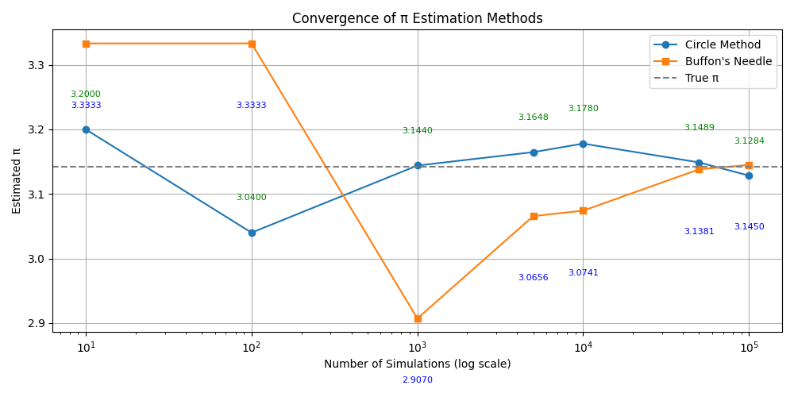

# Problem 2

## Estimating π Using Monte Carlo Methods

### Introduction

Monte Carlo simulations are a class of computational algorithms that rely on repeated random sampling to obtain numerical results. One elegant and accessible application is estimating the value of π through probability and geometry.

This project explores two Monte Carlo techniques for estimating π:

- Using random points inside a square and circle
- Using Buffon's Needle experiment

These simulations provide visual insight into the relationship between randomness and mathematical constants.

---

## Method 1: Monte Carlo Estimation with Random Points

### Concept

Imagine a square with a circle inscribed inside it. If you randomly generate points in the square, the proportion of points that fall inside the circle is related to π.

Let:
- The square be of size 2×2 (centered at the origin)
- The circle have a radius of 1

Then the area ratio is:

\[
\pi \approx 4 \times \left(\frac{\text{points inside circle}}{\text{total points}}\right)
\]

As the number of points increases, this ratio converges to π.

---

## Method 2: Buffon's Needle Experiment

### Concept

Buffon's Needle is a classic probability problem where a needle of length \(L\) is dropped on a floor with parallel lines spaced \(D\) units apart.

The probability \(P\) that the needle crosses a line is related to π by:

\[
\pi \approx \frac{(2 \times L \times \text{number of throws})}{(D \times \text{number of crossings})}
\]

This method uses randomness and geometry to estimate π through repeated trials.

### PHyton İmplementation

```python
import numpy as np
import matplotlib.pyplot as plt

def estimate_pi_circle(n_points=10000, visualize=True):
    x = np.random.uniform(-1, 1, n_points)
    y = np.random.uniform(-1, 1, n_points)
    inside = x**2 + y**2 <= 1
    pi_estimate = 4 * np.sum(inside) / n_points

    if visualize:
        plt.figure(figsize=(6, 6))
        plt.scatter(x[inside], y[inside], s=1, color='green', label='Inside Circle')
        plt.scatter(x[~inside], y[~inside], s=1, color='red', label='Outside Circle')
        circle = plt.Circle((0, 0), 1, color='black', fill=False)
        plt.gca().add_artist(circle)
        plt.title(f'π Estimate (Circle Method): {pi_estimate:.5f} (n={n_points})')
        plt.xlabel("x")
        plt.ylabel("y")
        plt.axis('equal')
        plt.legend()
        plt.grid(True)
        plt.tight_layout()
        plt.show()

    return pi_estimate

def convergence_analysis():
    trials = [10, 100, 1000, 5000, 10000, 50000, 100000]
    estimates_circle = [estimate_pi_circle(n, visualize=False) for n in trials]
    estimates_buffon = [estimate_pi_buffon(n, visualize=False) for n in trials]

    plt.figure(figsize=(10, 5))
    plt.plot(trials, estimates_circle, label="Circle Method", marker='o')
    plt.plot(trials, estimates_buffon, label="Buffon's Needle", marker='s')
    plt.axhline(np.pi, color='gray', linestyle='--', label='True π')

    for x, y in zip(trials, estimates_circle):
        plt.text(x, y + 0.05, f"{y:.4f}", fontsize=8, ha='center', color='green')
    for x, y in zip(trials, estimates_buffon):
        plt.text(x, y - 0.1, f"{y:.4f}", fontsize=8, ha='center', color='blue')

    plt.xscale("log")
    plt.xlabel("Number of Simulations (log scale)")
    plt.ylabel("Estimated π")
    plt.title("Convergence of π Estimation Methods")
    plt.legend()
    plt.grid(True)
    plt.tight_layout()
    plt.show()

if __name__ == "__main__":
    print("Estimating π using Circle Method:")
    pi_circle = estimate_pi_circle(10000)

    print("\nEstimating π using Buffon's Needle Method:")
    pi_buffon = estimate_pi_buffon(100000)

    print("\nRunning Convergence Analysis:")
    convergence_analysis()
```

   

   