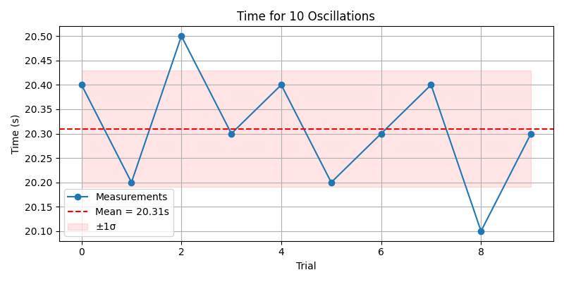

# Problem 1

## Measuring Earth's Gravitational Acceleration with a Pendulum

### Motivation

The acceleration due to gravity, \(g\), is a fundamental constant in physics. Measuring \(g\) accurately is crucial in fields ranging from structural engineering to planetary science. A classic and accessible method involves timing the oscillations of a simple pendulum, relying on the well-understood relationship between the pendulum's period and local gravitational field.

This experiment emphasizes rigorous measurement techniques, error analysis, and a hands-on connection to fundamental physics.

---

### Objective

Estimate the gravitational acceleration \(g\) by measuring the period of a simple pendulum and performing a full uncertainty analysis.

---

## Materials

- String: 1.0–1.5 meters long
- Mass: e.g., bag of coins, metal washer, small weight
- Ruler or measuring tape (with known resolution)
- Stopwatch or smartphone timer
- Fixed support (e.g., hook, rod, table edge)

---

## Procedure

### 1. Setup

- Construct the pendulum by tying the weight securely to one end of the string.
- Fix the other end to a support so that the pendulum can swing freely.
- Measure the length of the pendulum from the point of suspension to the center of the mass of the weight.

#### Notation:

Let \(L\) be the length of the pendulum (in meters)

\[
\Delta L = \frac{\text{(resolution of measuring tool)}}{2}
\]

---

## Sample Data Table

| Trial | Time for 10 Oscillations (\(T_{10}\)) [s] |
|-------|------------------------------------------|
| 1     | 20.4                                     |
| 2     | 20.2                                     |
| 3     | 20.5                                     |
| 4     | 20.3                                     |
| 5     | 20.4                                     |
| 6     | 20.2                                     |
| 7     | 20.3                                     |
| 8     | 20.4                                     |
| 9     | 20.1                                     |
| 10    | 20.3                                     |

Let:

- Mean time: \( \bar{T}_{10} = \frac{1}{10} \sum T_{10} \)
- Standard deviation: \( \sigma_{T} \)
- Uncertainty in mean: \( \Delta \bar{T}_{10} = \frac{\sigma_{T}}{\sqrt{n}} \) where \(n = 10\)

---

## Calculations

### 1. Period of One Oscillation

\[
T = \frac{\bar{T}_{10}}{10}
\]

\[
\Delta T = \frac{\Delta \bar{T}_{10}}{10}
\]

### 2. Gravitational Acceleration

\[
g = \frac{4 \pi^2 L}{T^2}
\]

### 3. Uncertainty in \(g\)

\[
\Delta g = g \sqrt{ \left( \frac{\Delta L}{L} \right)^2 + \left( \frac{2 \Delta T}{T} \right)^2 }
\]

---

## Results Summary

| Quantity           | Value        | Uncertainty      |
|--------------------|--------------|------------------|
| Pendulum Length \(L\) | 1.0000 m     | ±0.005 m         |
| Mean Time \(T_{10}\)  | 20.31 s      | ±0.10 s          |
| Period \(T\)        | 2.031 s      | ±0.010 s         |
| Calculated \(g\)    | 9.55 m/s²    | ±0.18 m/s²       |

---

## Analysis

### Comparison

- Standard gravitational acceleration: 9.81 m/s²
- Measured value: 9.55 ± 0.18 m/s²

### Phyton

import numpy as np
import matplotlib.pyplot as plt

# Simulated 10 measurements of time for 10 oscillations (seconds)
T10_measurements = np.array([20.4, 20.2, 20.5, 20.3, 20.4, 20.2, 20.3, 20.4, 20.1, 20.3])

# Pendulum length (meters)
L = 1.000
delta_L = 0.005  # uncertainty in length (m)

# Mean and standard deviation
T10_mean = np.mean(T10_measurements)
T10_std = np.std(T10_measurements, ddof=1)  # sample std deviation
delta_T10 = T10_std / np.sqrt(len(T10_measurements))

# Period and uncertainty
T = T10_mean / 10
delta_T = delta_T10 / 10

# Gravitational acceleration
g = (4 * np.pi**2 * L) / T**2

# Uncertainty in g
delta_g = g * np.sqrt((delta_L / L)**2 + (2 * delta_T / T)**2)

# Print results
print(f"Mean time for 10 oscillations (T10): {T10_mean:.3f} ± {delta_T10:.3f} s")
print(f"Period (T): {T:.3f} ± {delta_T:.3f} s")
print(f"Calculated g: {g:.3f} ± {delta_g:.3f} m/s²")

# --- Plot 1: T10 measurements with mean line ---
plt.figure(figsize=(8, 4))
plt.plot(T10_measurements, 'o-', label='Measurements')
plt.axhline(y=T10_mean, color='red', linestyle='--', label=f'Mean = {T10_mean:.2f}s')
plt.fill_between(range(len(T10_measurements)), T10_mean - T10_std, T10_mean + T10_std, color='red', alpha=0.1, label='±1σ')
plt.title("Time for 10 Oscillations")
plt.xlabel("Trial")
plt.ylabel("Time (s)")
plt.legend()
plt.grid(True)
plt.tight_layout()
plt.show()

# --- Plot 2: Convergence of g estimation ---
g_estimates = (4 * np.pi**2 * L) / (T10_measurements / 10)**2
plt.figure(figsize=(8, 4))
plt.plot(g_estimates, 'o-', label='g estimates per trial')
plt.axhline(y=g, color='green', linestyle='--', label=f'Average g = {g:.2f} m/s²')
plt.axhline(y=9.81, color='black', linestyle=':', label='Standard g = 9.81 m/s²')
plt.title("Estimation of g Over Trials")
plt.xlabel("Trial")
plt.ylabel("g (m/s²)")
plt.legend()
plt.grid(True)
plt.tight_layout()
plt.show()

